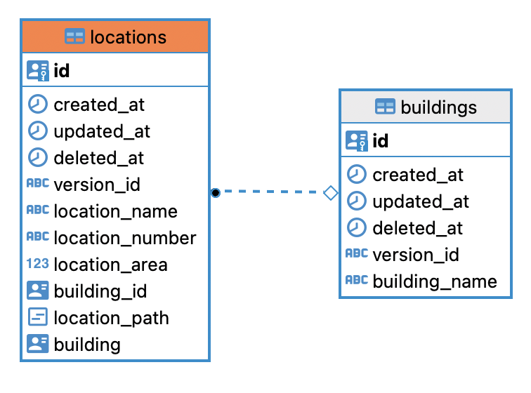
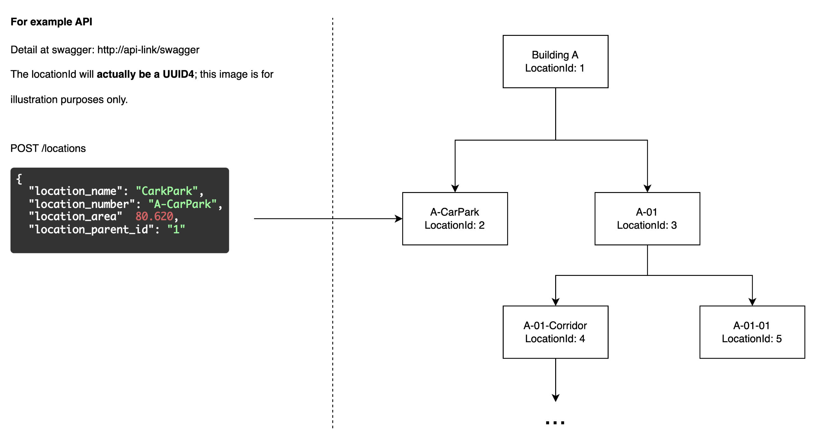
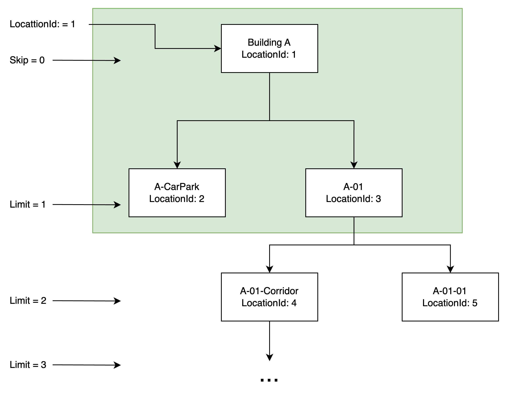

# Overview of the Relational Model


Imagine that we have multiple buildings, and each building contains multiple locations structured like a hierarchical tree.

I consider a building as a type of location, which means that whenever we perform CRUD operations on a building entity, its corresponding record in the locations table is also synchronized. Currently, the relationship is one-way from buildings to locations.

# API Document
Swagger: http://localhost:8888/swagger

In this article, I will only focus on locations, which are the core problem of this codebase. I will cover how to add a location and how to retrieve them correctly.

## Create a new location


You can also use CURL to visualize the process of adding location data.

location_parent_id is uid4, It's a building entity Id or Location Id
```
curl -X 'POST' \
  'http://localhost:8888/locations' \
  -H 'accept: */*' \
  -H 'Content-Type: application/json' \
  -d '{
  "location_name": "Cark Park",
  "location_number": "A-CarPark",
  "location_area": 80.620,
  "location_parent_id": "c2604c72-48a9-4010-9a33-d6b9cd1eebe9"
}'
```

## Retrieve a list of locations through subordinate
```
curl -X 'GET' \
  'http://localhost:8888/locations?skip=0&limit=1&location_id=c2604c72-48a9-4010-9a33-d6b9cd1eebe9' \
  -H 'accept: */*'
```

You can see that with the parameters skip=0 and limit=1, we will receive the following response.
```
{
  "status_code": 200,
  "message": null,
  "data": [
    {
      "id": "22946cda-806d-49a8-882a-7696b9c6e52c",
      "location_name": "A-CarPark",
      "location_number": "A-CarPark",
      "location_area": "80.620",
      "location_path": "c2604c7248a940109a33d6b9cd1eebe9.22946cda806d49a8882a7696b9c6e52c",
      "child_count": "0"
    },
    {
      "id": "b5ed4de8-ac2c-459c-9127-bbb48413ef87",
      "location_name": "A-01",
      "location_number": "A-01",
      "location_area": "10",
      "location_path": "c2604c7248a940109a33d6b9cd1eebe9.b5ed4de8ac2c459c9127bbb48413ef87",
      "child_count": "2"
    },
    {
      "id": "c2604c72-48a9-4010-9a33-d6b9cd1eebe9",
      "location_name": "Building A",
      "location_number": "Building A",
      "location_area": "-1",
      "location_path": "c2604c7248a940109a33d6b9cd1eebe9",
      "child_count": "2"
    }
  ],
  "duration": "40ms"
}
```

If you have ever encountered the format skip=0, limit=1,2,3 ..., you might recognize it as a form of pagination. However, in this codebase, which handles hierarchical data, I consider limit as one tier of the data. Take a look at the image to visualize what I mean.


Additionally, to determine which node is a child of another, refer to location_path. This is represented by concatenating strings.

```
"location_path": "c2604c7248a940109a33d6b9cd1eebe9" // Building A
"location_path": "c2604c7248a940109a33d6b9cd1eebe9.b5ed4de8ac2c459c9127bbb48413ef87" // A-01
"location_path": "c2604c7248a940109a33d6b9cd1eebe9.22946cda806d49a8882a7696b9c6e52c" // A-CarPark
```

If you are a frontend engineer, you may consider https://www.npmjs.com/package/d3-org-chart to draw it.